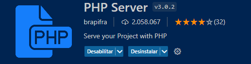
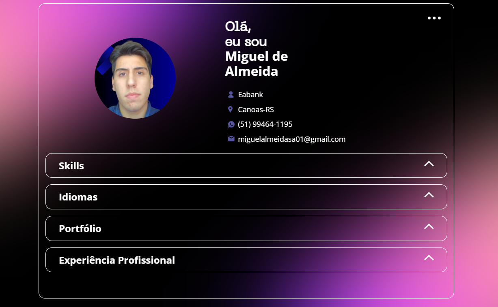
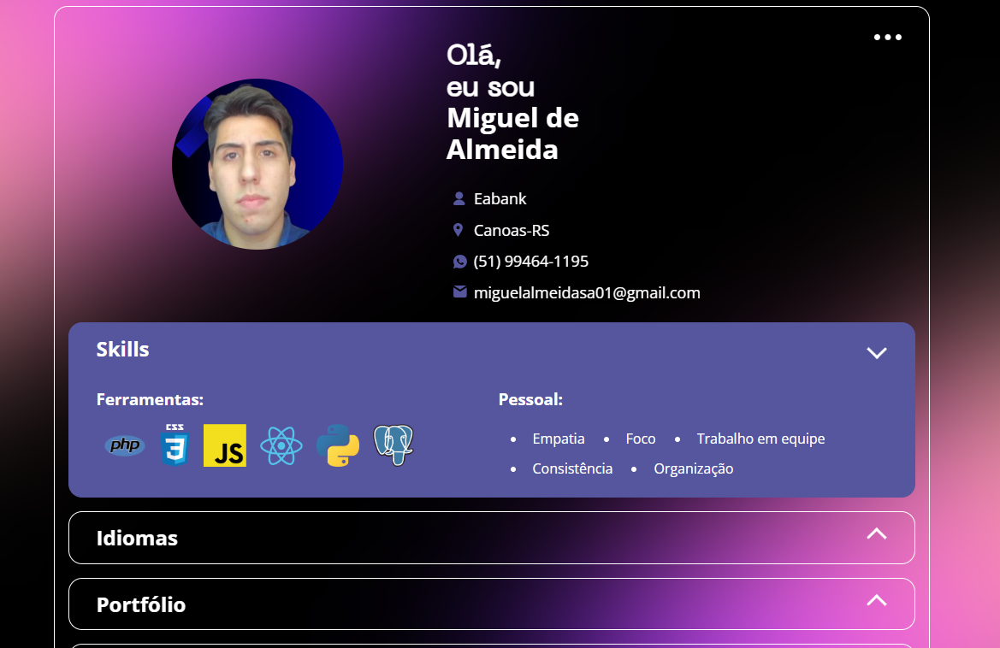
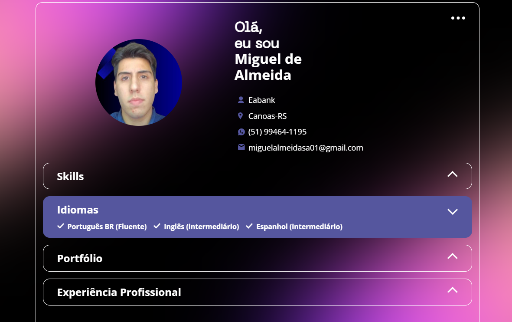
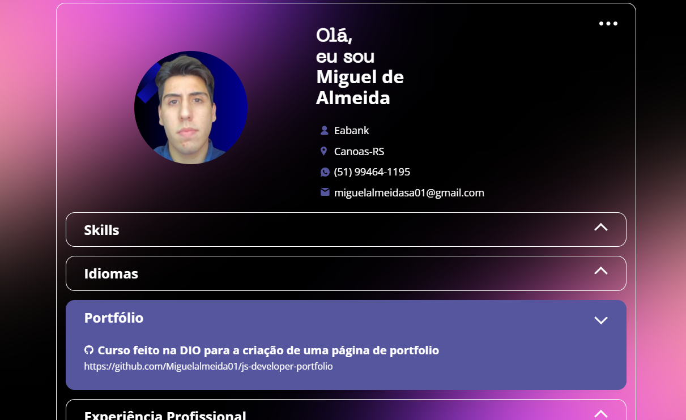
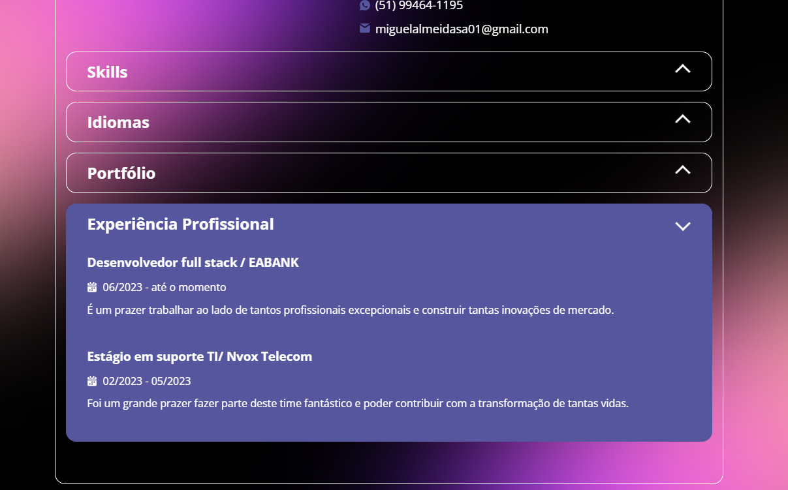

 

<a href="Readme.md">inglês</a>

# Entrega de projeto - Criando um portifólio web | DIO

Este projeto é uma aplicação de portfolio web totalmente funcional construída usando js. O principal objetivo deste projeto é demonstrar como construir componentes organizar efetivamente seu projeto.

## Tecnologias Utilizadas

- JS
- CSS   
- HTML
- JSON

## Como Executar o Projeto

1. Clone o repositório:

   ```bash
   git clone https://github.com/Miguelalmeida01/js-developer-portfolio.git
   ```

2. Acesse o projeto no navegador:
   
   Usando a extensão do vscode PHPServer

   

## Projeto na web

   
   
   
   
   